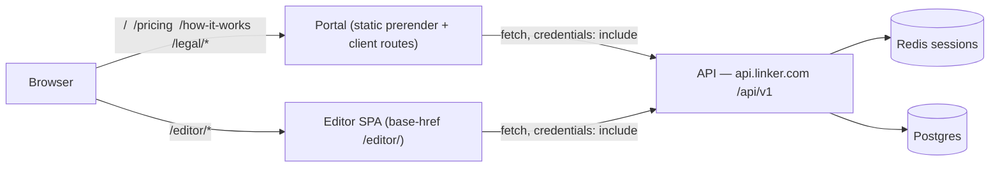

# Linker Portal — Plan

Status: **draft v4** · 2026-09-27

The portal is the public face of Linker: a marketing landing page, auth (login / register / password reset), the user's account cabinet, legal pages, and the entry point into the widget editor. It inherits the editor's visual language but speaks to business owners, not developers.

> **Naming:** the product name is **Kitlet** (web search 2026-09-27 found no software product using it; owner checked domains/handles). "Linker" stays the technical/repo name, and **`linker.com` is a placeholder domain** throughout this plan until the Kitlet domain is registered in milestone **M8 (pre-production)**. Until then, no domain, brand name or email address is hardcoded — see §14 "Configurable identity".

Sources this plan builds on (not restated here — follow the links):

- Editor overview: `linker-editor/linker-editor-UI/docs/index.md`
- API architecture, data model, security model: `linker-backend/docs/planning.md`, `linker-backend/CLAUDE.md`
- Editor design reference: `linker-editor-UI/docs/prototype/editor.html`

---

## 1. Locked decisions

| # | Decision | Choice | Why |
|---|---|---|---|
| D1 | Portal stack | **Angular (latest stable) with SSR tooling, marketing routes prerendered** | Same skills as the editor; per-route render modes give static SEO pages and client-only auth pages from one app. |
| D2 | Editor integration | **Separate app, served same-origin at `/editor/`** | Zero coupling of Angular versions (editor is on 19, EOL blocker in `dependency-triage.md`); independent deploys; shares the session cookie for free. |
| D3 | Domains | **`linker.com` (portal + `/editor/`) · `api.linker.com` (API)** | Same registrable site → `sameSite: 'lax'` session cookie works and the backend's "no CSRF token" decision (planning.md §5) stays valid. |
| D4 | Languages | **English only, i18n-ready** | All copy through translation keys; adding a locale is config + a JSON file. |
| D5 | Cookies | **Necessary (session, consent) + Google Analytics 4** | GA4 is opt-in only; see §7. |
| D6 | Terms acceptance | **Versioned backend record, gated on first editor open** | Legal proof of *which* version was accepted *when*; survives devices. |
| D7 | Backend gaps | **Extend the API now** (profile PATCH, billing read, consents) | Cabinet ships complete instead of "coming soon" stubs. |
| D8 | Animations | **CSS + IntersectionObserver + inline SVG** | ~0 KB of JS runtime, SSR-safe, respects `prefers-reduced-motion`. |
| D9 | Email verification | **Required before the editor opens**; admins can verify manually (CLI) for dev/debug | Stops throwaway/typo accounts from publishing widgets; manual path unblocks testing without mail. |
| D10 | Legal footing | **Ukrainian operator, B2B-only service, GDPR as the global baseline** | Serving the EU triggers GDPR regardless of where the company sits; meeting it covers most of US/LatAm/Asia too. See §9a. |
| D11 | Analytics scope | **GA4 on portal pages only — never inside `/editor/`** | Keeps the product surface tracker-free; fewer cookies to disclose. |

> **Heads-up for the backend docs:** planning.md §5 names the editor host as `app.linker.com`. D2/D3 move it to `linker.com/editor/`. Still same-site, so nothing breaks — but update that paragraph so the next reader isn't misled.

---

## 2. Topology



- **The portal can be fully static.** Marketing routes are prerendered at build time; auth and account routes render client-side (they depend on the session, which SSR can't see — the cookie is host-only on `api.linker.com`). So no Node server in production: a CDN/nginx serves both apps.
- Routing at the edge: `/editor/*` → editor bundle (SPA fallback to `/editor/index.html`); everything else → portal (SPA fallback to the portal shell for client routes, real `404.html` for unknown paths so crawlers get a 404 status).
- API: add `https://linker.com` to `CORS_ORIGINS`. The session cookie stays host-only on `api.linker.com`; no `domain=` widening needed.

### Dev setup

- Portal `ng serve` on `:4000`, editor on `:4200` with `--base-href /editor/ --serve-path /editor/`, API on `:3000`.
- Portal `proxy.conf.json` forwards `/editor` → `:4200`, so the "Editor" link behaves exactly as in prod.
- `localhost:4000 → localhost:3000` is same-site, so cookies behave like prod.

---

## 3. Information architecture

| Route | Render | Indexed | Auth |
|---|---|---|---|
| `/` | Prerender | yes | public |
| `/pricing` | Prerender | yes | public |
| `/how-it-works` (+ `/how-it-works/:guide`) | Prerender | yes | public |
| `/legal/terms`, `/legal/privacy`, `/legal/cookies`, `/legal/feedback-program` | Prerender | yes | public |
| `/feedback` | Prerender shell + client form | yes | public page; submitting requires login (reward is tied to the account) |
| `/login`, `/register`, `/forgot-password`, `/reset-password` | Client | `noindex` | guest-only |
| `/verify-email` (pending screen), `/verify-email/confirm?token=` | Client | `noindex` | auth / public |
| `/account/profile`, `/account/security`, `/account/plan`, `/account/privacy` | Client | `noindex` | auth |
| `/editor/*` | separate app | `Disallow` | auth (editor-side) |

### Header navigation

`Logo · Product · Pricing · How it works · [ ▶ Open editor ] · Log in | Sign up` (logged in: avatar menu → Account, Log out)

- **"Open editor" is visually distinct** — filled accent pill (`--accent`), editor glyph, slight glow on hover — so it reads as "the app", not another content page. Anonymous users see a small lock badge on it.
- It's a plain `<a href="/editor/">` (a different app → full navigation). When anonymous the href is `/login?returnUrl=%2Feditor%2F`; after login we `location.assign(returnUrl)`.
- `returnUrl` is validated: relative, same-origin paths only (`^/(?!/)`), otherwise fall back to `/` — prevents open redirects.
- On the editor side, a matching thin app bar (logo → portal, Account, Log out) so users can always get back.

---

## 4. Portal code structure

```
src/app/
  core/
    api/            api-client.ts, api-error.ts, *.api.ts (AuthApi, UsersApi, BillingApi, ConsentsApi)
    auth/           session.store.ts, auth.facade.ts, auth.guard.ts, guest.guard.ts, return-url.ts
    http/           credentials.interceptor.ts, error.interceptor.ts
    consent/        consent.service.ts, consent.store.ts, loaders/ga4.loader.ts
    seo/            seo.service.ts, json-ld.ts
    i18n/
    config/         app-config.token.ts (API_BASE_URL, LEGAL_VERSIONS …)
  layout/           shell, site-header, site-footer, cookie-banner
  shared/ui/        button, card, field, plan-card, reveal.directive, …
  features/
    marketing/      home, pricing, how-it-works
    auth/           login, register, forgot-password, reset-password
    account/        profile, security, plan, privacy
    legal/          terms, privacy, cookies
```

Standalone components, `OnPush`, signals everywhere, lazy routes per feature.

## 5. Patterns

| Concern | Pattern | Detail |
|---|---|---|
| HTTP | **Adapter / Repository** | One `*Api` class per backend resource behind an `InjectionToken`; components never touch `HttpClient`. Tests swap in in-memory fakes. |
| Auth state | **Facade + signal store** | `SessionStore` holds `user`, `status: 'unknown' \| 'anonymous' \| 'authenticated'`. `AuthFacade` exposes `login/register/logout/refresh`. No NgRx — the portal's state is small; `@ngrx/signals` is fine if it grows. |
| Session bootstrap | `provideAppInitializer` | Calls `GET /auth/me` once in the browser (skipped during prerender); 401 → `anonymous`. |
| Route protection | Functional guards | `authGuard` → `/login?returnUrl=…`; `guestGuard` bounces logged-in users off `/login`. UI guards are convenience — the API is the real boundary. |
| Cross-cutting HTTP | Interceptors | `credentials` adds `withCredentials` **only** for the API origin. `error` maps 401 → clear session + redirect; 429 → "too many attempts" toast; normalises NestJS validation errors into `{ field → message }`. |
| Forms | Typed reactive forms | Validators mirror backend DTOs (email ≤ 320, password 12–256, names 1–100, company ≤ 200); server field errors (409 email taken) mapped back onto controls. |
| Consent | **Strategy + Observer** | Each category registers loader strategies (`Ga4Loader`); `ConsentService` runs them when the category flips to granted. Components react to a `consent()` signal. |
| SEO | Route data → `SeoService` | Each route declares `title/description/canonical/og/jsonLd`; a router listener applies them. |

---

## 6. Landing page content (home)

Semantic skeleton: `header > nav`, `main > section[aria-labelledby]` ×N, `footer`; exactly one `h1`.

1. **Hero** — positioning is *selling*, not widget-building: "Turn more of your visitors into buyers." Audience: online stores, dropshippers, local businesses, small brands. Primary CTA *Start free*, secondary *See how it works*. Visual: a promo offer snapping onto a store page.
1a. **Built for people who sell** — four audience cards (online stores, dropshippers, local businesses, small brands).
2. **Trust strip** — "Free plan · No credit card · Works on any website" (logos later).
3. **How it works** — 3 steps: *Design* → *Publish* → *Measure*, each with a small looping SVG vignette.
4. **Benefits for business** — no dev time; on-brand by default; embeds never clash with the site's CSS (Shadow DOM); version history & instant rollback; interaction analytics & notifications.
5. **Use cases** — lead capture forms, promo banners, newsletter signup, feedback widgets.
6. **Pricing teaser** — Free plan card (limits from `GET /billing/plans`, baked in at build time with a client refresh) + "Pro — coming soon".
7. **FAQ** — `<details>` accordions + `FAQPage` JSON-LD.
8. **Final CTA** band.

`/how-it-works`: short guides — create account, build your first widget, embed the snippet, publish & roll back. Each guide is an `<article>` with `HowTo` JSON-LD.

### Visual system

- **Brand:** the Kitlet design system (tokens, logo rules, voice) is the source of truth; logo SVGs live in `brand/logos/`. Primary `kit-blue` (#2f6feb, same as the editor accent), accent `spark` (#ff6b35), navy `night`; display face Bricolage Grotesque over IBM Plex Sans/Mono.

- Extract the prototype's tokens (`--accent`, `--ink*`, `--panel*`, `--line*`, radii, shadows, IBM Plex Sans/Mono, light + dark) into a shared **`@linker/tokens`** CSS package consumed by both portal and editor.
- Marketing layer on top: larger type scale (`clamp()`-based, h1 ~48–64px), generous section rhythm, soft accent gradients/dotted-grid backgrounds echoing the editor canvas. Mono font only for small "technical" accents.
- **Self-host IBM Plex** (subset, `font-display: swap`, preload the 400/600 weights). Also a GDPR point: loading Google Fonts from Google's CDN sends visitor IPs to Google without consent.

### Animations

- `revealOnScroll` directive: adds `.is-visible` once via `IntersectionObserver`; runs only in the browser (`afterNextRender`), so prerendered HTML is fully visible content (good for SEO and no-JS).
- CSS keyframes + SVG `stroke-dashoffset` / transform animations for hero and step vignettes.
- `@media (prefers-reduced-motion: reduce)` → static end-state. Animate only `transform`/`opacity` (no layout thrash, no CLS).

---

## 7. SEO checklist

- Prerendered HTML for every indexable route; unique `<title>`, meta description, canonical, Open Graph + Twitter cards, OG image per page.
- JSON-LD: `Organization`, `WebSite`, `SoftwareApplication` (with `offers` price 0), `FAQPage`, `HowTo`, `BreadcrumbList`.
- `sitemap.xml` generated at build from the prerender route list; `robots.txt` disallows `/account`, `/editor`, auth pages; auth/account also carry `<meta name="robots" content="noindex">`.
- `<html lang="en">`, `hreflang` scaffolding ready for D4.
- Budgets in CI (Lighthouse CI): SEO ≥ 95, Accessibility ≥ 95, LCP < 2.5 s, CLS < 0.1. `NgOptimizedImage`, AVIF/WebP, explicit dimensions.

---

## 8. Cookies & consent (GDPR + CCPA)

**Categories**

| Category | Cookies | Legal basis |
|---|---|---|
| Necessary | API session cookie (`api.linker.com`), `linker_consent` | Strictly necessary — no consent required, disclosed in cookie policy |
| Analytics | GA4 (`_ga`, `_ga_*`) | **Opt-in** |

**Banner behaviour**

- Shown on first visit until a choice is made. **Accept all**, **Reject all** and **Customize** with equal visual weight; nothing pre-ticked; the page stays usable (non-blocking bottom sheet).
- Choice stored in first-party `linker_consent` cookie: `{ v: policyVersion, analytics: bool, ts }`, 12 months. Bumping the policy version re-prompts.
- Footer link **"Cookie settings"** reopens the panel at any time; withdrawing consent deletes `_ga*` cookies.
- **Global Privacy Control** (`navigator.globalPrivacyControl`) is honoured as an opt-out (required under CCPA/CPRA); a **"Your privacy choices"** footer link for California visitors.

**GA4 wiring (strict / "basic" consent mode)**

1. Inline in `index.html` before anything else: `gtag('consent','default',{analytics_storage:'denied', ad_storage:'denied', ad_user_data:'denied', ad_personalization:'denied'})`.
2. The `gtag.js` script is **not injected** until analytics consent is granted — no request to Google at all before that.
3. On grant: `Ga4Loader` injects the script, `gtag('consent','update',{analytics_storage:'granted'})`. Ads signals and Google signals off.
4. SPA page views sent from a `NavigationEnd` listener (`send_page_view: false` on config).
4a. Portal only (D11): the editor bundle contains no gtag code, and `/editor/` navigation is a full page load, so GA naturally stops at the boundary. Funnel events worth sending: `sign_up`, `login`, `email_verified`, `open_editor_click`.
5. Never send PII (emails, names) as event params.

---

## 9. Terms gate on first editor open

**Backend (new):** `user_consents`

```
id uuid pk · user_id fk → users (cascade) · document text ('terms' | 'privacy')
version text · accepted_at timestamptz · ip_hash text null · user_agent text null
unique (user_id, document, version)
```

- Current versions come from config (`LEGAL_TERMS_VERSION`, e.g. `2026-10-01`).
- `GET /auth/me` gains `legal: { termsVersionCurrent, termsVersionAccepted, requiresTermsAcceptance }`.
- `POST /users/me/consents` `{ document: 'terms', version }` — `400` unless `version` equals the current one; idempotent.

**Editor bootstrap:**

Gates run in a fixed order, as a small **chain of responsibility** (`AuthGate → VerifiedGate → TermsGate`), each either passing or redirecting:

1. `GET /auth/me` → 401 → `location.assign('/login?returnUrl=' + encodeURIComponent(location.pathname))`.
1a. `emailVerified === false` → `location.assign('/verify-email?returnUrl=…')` (portal page, §10).
2. `requiresTermsAcceptance` → full-screen, non-dismissible dialog: scrollable terms (fetched from the portal's `/legal/terms` content), a key-points summary at the top, checkbox "I have read and agree…", **Accept** / **Decline** (Decline → back to portal).
3. On accept → POST → editor loads. A new terms version re-triggers the dialog for everyone.

**Terms must cover** (legal review required — see §13):

- Service description, free-plan limits and the right to change them.
- Account responsibilities; password and session security.
- **Acceptable use** — critical because customer widgets run on third-party sites: no phishing/credential-harvesting forms, no malware, no deceptive content; Linker may disable widgets.
- **Data roles** — for data visitors submit through a customer's widget, the customer is controller and Linker is processor → **Data Processing Addendum** (GDPR Art. 28) + subprocessor list.
- Security measures (TLS, argon2id password hashing, server-side sessions), retention, deletion on account closure.
- Ownership of widget content; licence Linker needs to host/serve it.
- Availability (no SLA on free), liability limits, termination, governing law, how changes are notified and re-accepted.

---

## 9a. Legal & compliance footing

> The documents are drafted and live under `/legal` (M7 texts). How they are maintained, the backend and editor controls they rely on, and the operator's pre-launch checklist: [`legal-plan.md`](legal-plan.md).

**Facts:** operator is a Ukrainian business; users mostly US and EU, also Latin America and Asia; **no lawyer review planned**.

| Regime | Applies because | What we do |
|---|---|---|
| **EU GDPR** (+ UK GDPR) | We offer the service to people in the EU/UK (Art. 3(2)), regardless of where we're based | Privacy policy per Art. 13; lawful bases stated; DPA for customers; data-subject rights handled via cabinet (edit, delete) + a privacy contact email; records of processing kept internally |
| **EU representative (Art. 27)** | Non-EU controller processing EU residents' data | Needed unless processing is occasional and low-risk — ours is continuous. Budget for an EU-rep service (typically a low annual fee); same for a UK rep |
| **International transfers** | Ukraine has **no EU adequacy decision** | Host data in an **EU region** (§14); Standard Contractual Clauses with subprocessors; admin access from Ukraine counts as a transfer, so cover it in the DPA |
| **Ukraine — Law on Personal Data Protection** | Home jurisdiction | GDPR-level practice satisfies it; keep the privacy policy's controller identity and address accurate |
| **US — CCPA/CPRA + state laws** | California/other-state users | Thresholds likely not met at launch, but we already honour GPC and provide "Your privacy choices"; don't sell/share data |
| **Brazil — LGPD** | LatAm users | GDPR-aligned policy covers it; name a data-protection contact |
| **Asia (Japan APPI, Singapore PDPA, Korea PIPA …)** | Asian users | GDPR baseline + transfer disclosure in the privacy policy; no China-specific processing planned |

**Mitigations for skipping lawyer review** (it remains the biggest legal risk in this plan — revisit before paid plans or any enterprise customer):

- **B2B only.** Terms state the service is for businesses and people acting for their business. This avoids most consumer-protection law (EU consumer withdrawal rights, mandatory local-court clauses).
- **Governing law: Ukraine; courts of Kyiv.** Add "without prejudice to mandatory data-protection rights" — GDPR rights can't be contracted away anyway.
- Start from reputable, published SaaS templates rather than writing from scratch. Keep language plain. Version every document (`LEGAL_TERMS_VERSION`) so fixes trigger re-acceptance.
- The **DPA and subprocessor list** matter most, because customers' widgets collect *their* visitors' data. Keep them accurate as infrastructure changes.
- Minimise data: nothing beyond what's in `users` today; phone is optional; IPs in consent records are hashed.

---

## 10. Auth & cabinet

**Register** — first name, last name, email, company (optional), password (12+ chars, strength meter, show/hide), plan selector showing plan cards from `GET /billing/plans` with **only Free selectable** (others "coming soon"). `/pricing` CTAs link `/register?plan=free`. Privacy-notice line under the button (informational, not consent). On `201` → session exists, but `emailVerified` is false → go to `/verify-email`. `409` → "An account with this email already exists — log in?" (backend is knowingly enumerable here, planning.md §5).

**Login** — email + password; 429 message; link to forgot-password.

**Forgot / reset** — forgot always shows the same "if an account exists, we've sent a link" message (matches the backend's `202`); reset reads `?token=`, strips it from the URL with `history.replaceState`, shows one generic error for invalid/used/expired.

**Verify email**

- `/verify-email`: "Check your inbox" screen with the address, **Resend** (disabled with a 60 s countdown; backend throttles too), and "Wrong email? Log out and register again" (email change is Phase 7).
- `/verify-email/confirm?token=…`: strips the token from the URL, calls the API, then shows success → `returnUrl` or "Open editor". Invalid, expired or used tokens all get one generic message plus a Resend button (same indistinguishability rule as password reset).
- The cabinet stays usable while unverified; only the editor is gated. The header shows a subtle "Verify your email" banner until done.

**Cabinet `/account`**

| Section | Contents | API |
|---|---|---|
| Profile | first/last name, company, phone (country picker + E.164), language (only EN listed), email read-only | `PATCH /users/me` *(new)* |
| Security | change password (current + new; note it signs out other devices), **Log out all devices** | `POST /auth/password/change`, `POST /auth/logout-all` |
| Plan & billing | current plan card, limits (`maxWidgets`, `monthlyViews` …), status, "Upgrade — coming soon" | `GET /billing/subscription` *(new)* |
| Privacy | cookie preferences, accepted terms version + date, **Delete account** (typed confirmation) | `DELETE /users/me` *(new)* |

---

## 10a. Feedback & idea rewards

**Offer:** a user suggests a feature, improvement or bug fix. **If the result ships as a feature of a paid plan**, it is unlocked on the account that suggested it free of charge, on any plan (including Free), for as long as the account is active. Anything that ships to every plan, improves something the user already has, or fixes a bug reaches everyone anyway. Its reporter gets a "Shipped, thank you" status and an email, not an unlock. The public promise must never read bigger than this. Goal: acquisition (a distinctive promise on the landing page) and retention (users hold perks they'd lose by leaving, and they're invested in a roadmap they helped shape).

**Rules (defaults, confirm before launch):**

- Only logged-in, email-verified accounts can submit, so every reward has an owner.
- Duplicates: everyone who submitted the idea **before** it was approved gets the reward. Later submitters get "already planned".
- Two outcomes, decided at ship time by where the result lands:
  - **Paid-plan feature** → per-account unlock (`reward = 'unlock'`).
  - **Everything else** (ships to Free, improves an existing capability, bug fix) → "Shipped, thank you" status + email (`reward = 'thanks'`).
- We decide what's approved. Approval means "we will build it"; which outcome applies is known when it ships (it may show earlier as "Planned for Pro").
- **Plan limits are never unlocked through feedback.** Widgets, monthly views, versions per widget and any other quota always follow the user's plan, including when the suggestion was "give me more X". Only on/off capabilities can be granted.
- Rewards aren't transferable, have no cash value, and end if the account is deleted. Grants are ignored while the user is soft-deleted (`deleted_at` set) and come back if the account is restored.
- Program changes apply only to future submissions: a submission is judged by the rules in force when it was sent, so ideas approved but not yet shipped are honoured too, not only rewards already granted.

**Pages:**

- `/how-it-works`: six-step guide (sign up → pick an offer → design → connect store once → publish/rollback → see what sells), with a feedback teaser.
- `/feedback`: rules panel, form (type: feature / improvement / bug; title; description; area; optional screenshot; contact consent), and a "Your ideas" list with statuses `submitted → under_review → approved → shipped` (shown as "Shipped · free for you" or "Shipped · thank you" per `reward`) or `declined` / `duplicate`.
- Landing: "Build Kitlet with us" band and a pricing bullet.
- Account › Plan & billing: a "Paid features unlocked by your ideas" section, with a line that limits always follow the plan.

**Backend (new `feedback` module + entitlements change):**

```
feedback_items   id, user_id fk, kind ('feature'|'improvement'|'bug'), title, body, area,
                 status, duplicate_of fk null, feature_key text null, reward text null ('unlock'|'thanks'), contact_ok bool,
                 attachment_key text null, approved_at timestamptz null, tracker_url text null,
                 created_at, updated_at
feature_grants   id, user_id fk, feature_key text, source_feedback_id fk, granted_at,
                 unique (user_id, feature_key)
```

- **Where submissions go:** the API's Postgres (`feedback_items`) is the system of record. Rewards need a verified `user_id`, a status history and duplicate links, and none of that survives in an external tracker. On each new submission the API emails an admin inbox (`FEEDBACK_NOTIFY_TO`, via `MailerPort`) with the id, kind and title only. User text is never auto-posted to GitHub Issues: issues are visible to anyone with repo access (everyone, if the repo is public), and the text may hold personal or store data. Once an item is approved, the maintainer opens a GitHub issue by hand for the engineering work (paraphrased, no user identity) and records it with `feedback:set-tracker <id> <url>`. A `TrackerPort` adapter that does this automatically can come later.
- `POST /feedback` (auth + verified; throttled, e.g. 5/day per user), `GET /feedback/mine`. **Screenshots are v2:** the API has no object-storage adapter yet, so pre-signed S3 upload (image types only, size-capped) arrives as a `StoragePort` + adapter, not in the first cut.
- **Depends on Phase 5.** `EntitlementsService`, `QuotaGuard` and `/billing/*` don't exist yet (billing is entities-only), so feedback submission can ship first, but grants can't take effect until Phase 5 lands. The backend plan names the method `EntitlementsService.for(userId)`; pick one name.
- **Entitlements = plan features ∪ personal grants.** `EntitlementsService.resolve(user)` composes a `PlanEntitlementSource` and a `GrantEntitlementSource` (composite pattern), so `QuotaGuard` and feature checks never need to know why a feature is on. `GET /billing/subscription` returns both, so the cabinet can label unlocked features.
- Approval at ship time: `feedback:set-status <id> approved` stamps `approved_at`. When a feature ships behind a `feature_key`, grants go to every item linked to it, directly or via `duplicate_of`, whose `created_at < approved_at` of the item it was merged into. Merged duplicates carry status `duplicate`, not `approved`, so "every approved item" would miss exactly the people the duplicate rule promises to reward. All grants are written in one `runInTransaction`.
- `features:ship` is idempotent: grants insert with `ON CONFLICT (user_id, feature_key) DO NOTHING`, and emails go only for rows actually inserted, so a re-run after a partial failure neither errors nor double-mails.
- Admin for now: CLI commands: `feedback:list`, `feedback:set-status <id> <status>`, `feedback:link <id> <feature_key>`, `feedback:merge <dup> <into>`, `feedback:set-tracker <id> <url>`, `features:ship <feature_key>`. **The API has no CLI yet**: there is no `users:verify` command today, so the first of these adds the CLI entry point (e.g. `nest-commander`) that manual verification will reuse. An admin UI can come later on the same service.
- Feature keys are validated against the `FeatureKey` registry by both `plans.features` and `feedback:link`, so a renamed key fails loudly instead of silently orphaning grants.
- Status-change emails via `MailerPort` (i18n-ready templates), one per outcome (`unlock` / `thanks`).
- **Limits can't be granted, by construction:** grants are keyed by a `FeatureKey` from the registry of boolean capabilities; `PlanLimits` quota fields (`maxWidgets`, `maxVersionsPerWidget`, `monthlyViews`) are not `FeatureKey`s, so `GrantEntitlementSource` can only ever turn capabilities on and `QuotaGuard` reads limits from the plan alone. A unit test asserts that no quota name is a valid `FeatureKey`.
- `features:ship <feature_key>` reads the key's minimum plan: above Free → grants + `unlock` emails; Free → no grants, `thanks` emails.
- GA4 (portal only): `feedback_submit` with `kind`, never the text.

**Legal:** the Terms need a **feedback licence** clause: the user grants a free, perpetual licence to use their suggestion, and submitting creates no ownership or payment claim beyond the reward. Put the reward rules on `/legal/feedback-program`, versioned like the Terms.

## 11. Backend work (linker-backend)

Pulled forward from planning.md Phase 3 / Phase 5, plus the consent addition:

1. `PATCH /users/me` — `UpdateProfileDto`: names, company, phone (E.164 via `libphonenumber-js`), `preferredLanguage ∈ SUPPORTED_LANGUAGES`.
2. `GET /billing/plans` *(public)*, `GET /billing/subscription` *(read-only, with resolved limits)*.
3. `user_consents` entity + migration, `POST /users/me/consents`, legal block in `/auth/me` response DTO.
4. `DELETE /users/me` — soft delete + session purge (GDPR erasure).
5. **Email verification** — `email_verification_tokens` table mirroring `password_reset_tokens` (32 CSPRNG bytes emailed raw, sha256 stored, single use; TTL 24 h). Register sends the mail after the transaction commits. `POST /auth/email/verify` *(public)* `{ token }` sets `users.email_verified_at`; `POST /auth/email/resend` (auth, throttled per user + IP). `emailVerified` added to the `/auth/me` response. Reuse the existing `token-hash.ts` and the reset-token repository shape — ideally extract one generic single-use-token service both flows use (**template method**: shared issue/consume, per-flow TTL and mail template).
5a. **Manual verification for dev/debug** — a CLI command, not an HTTP endpoint: `pnpm cli users:verify <email>` (tsx script using the app's `DataSource`, same as the migration CLI). No admin role or admin routes exist yet, and a CLI adds no attack surface. It logs who ran it. When an admin panel arrives later, the same `UsersService.markEmailVerified()` backs it.
5b. Optional: `RegisterDto.planCode?` accepting only `'free'`, for forward compatibility with paid plans.
6. Config: `CORS_ORIGINS` gains `https://linker.com` (+ dev origins); `LEGAL_TERMS_VERSION`.
7. Docs: update planning.md §4 tables and the §5 host note.

---

## 12. Editor work (linker-editor)

1. Build with `--base-href /editor/`; API base URL + `withCredentials` from environment config.
2. Bootstrap auth check + redirect (§9.1), terms dialog (§9.2).
3. Thin app bar: logo → `/`, Account → `/account`, Log out.
4. Consume `@linker/tokens` instead of local copies.

---

## 13. Milestones

| # | Milestone | Done when |
|---|---|---|
| M0 | Scaffold | Angular workspace, render-mode routes, `@linker/tokens`, layout shell, lint/format/test in CI |
| M1 | Marketing | Home, pricing, how-it-works (6-step guide), legal placeholders; SEO service, JSON-LD, sitemap/robots; animations; Lighthouse budgets green |
| M2 | Consent | Banner + settings, GA4 loader, GPC; e2e proves no Google request before consent |
| M3 | Auth | Login/register/forgot/reset against the existing API; verify-email screens; guards, interceptors, returnUrl |
| M4 | Backend | §11 items 1–7 (incl. email verification + CLI verify) with unit + e2e specs |
| M5 | Cabinet + feedback | Profile, security, plan, privacy sections; `/feedback` page, feedback module, feature grants in entitlements (§10a) |
| M6 | Editor integration | §12 done; `/editor/` routing in dev proxy and edge config; terms gate e2e |
| M7 | Launch hardening | Terms, privacy, cookie policy and DPA drafted from templates (§9a); EU/UK representative arranged; axe a11y pass; 404/error pages; OG images |
| M8 | Pre-production identity | Product name chosen (basic trademark search in US/EU registers); domain registered; DNS on Route 53; email aliases `privacy@`, `support@`, `noreply@` (forwarding via SES receiving rules or a forwarding service); SES domain verified (SPF/DKIM/DMARC) + production access; TLS certificates (ACM); env config switched; legal pages updated with final name and contacts |

**Testing**: Vitest for facades, guards, interceptors, consent service; Playwright e2e for the funnel *landing → register → verify email (via Mailpit) → open editor → terms → editor loads* and for consent (no GA before opt-in, cookies removed on withdrawal); Lighthouse CI + axe in the pipeline.

---

## 14. Infrastructure & contacts

**Hosting: AWS, US + EU.**

- **One data region, not two.** Postgres, Redis and the API live in a single primary region. Recommended: `eu-central-1` (Frankfurt), because EU data then never leaves the EU and US traffic is still fast via CloudFront. Running live data in two regions (per-user residency) is a large project — defer until a customer actually requires it.
- If the primary ends up in a US region instead: EU→US transfers are lawful via the AWS DPA + SCCs (AWS also participates in the EU-US Data Privacy Framework). Disclose it in the privacy policy either way.
- **CloudFront** serves the portal and `/editor/` from S3 globally and fronts `api.linker.com`.

**Controller & privacy contact** (goes into the privacy policy and terms):

- Controller: **Vladyslav Kiskin, Kyiv, Ukraine** — confirm whether it's as an individual or a registered sole proprietor (ФОП); the policy should name the legal form.
- Contact: until the production domain exists, dev/staging legal pages use the owner's personal inbox. At M8, switch to **`privacy@<domain>`** forwarding to that inbox, so the personal address stays off crawled pages and survives a change of inbox.

**Configurable identity** — so the M8 rename is config, not a refactor:

- Portal: an `APP_IDENTITY` injection token `{ productName, siteUrl, apiUrl, editorPath, contacts: { privacy, support }, legalEntity }` loaded from environment files; templates, SEO service, JSON-LD and legal pages read from it. Translation keys use `{productName}` interpolation instead of literal "Linker".
- Backend: `APP_NAME`, `PUBLIC_SITE_URL` (used in email links), `MAIL_FROM`, `PRIVACY_CONTACT` env vars validated by the existing Zod env schema; email templates take them as parameters.
- Build-time: `sitemap.xml`, `robots.txt`, canonical URLs and OG tags generated from `siteUrl`.

**Transactional email: Amazon SES** (proposed)

- Same AWS account and region as the API; IAM-scoped credentials, no extra vendor or DPA.
- **No code change to start:** the backend's `MailerPort` already has an SMTP adapter, and SES exposes SMTP. A native SES API adapter can come later.
- Setup tasks (M8, once the domain exists): verify the domain; SPF, DKIM and DMARC records; a `mail.linker.com` custom MAIL FROM; request production access (new accounts start in the SES sandbox, which only sends to verified addresses); wire bounce/complaint notifications (SNS) → mark the address undeliverable so resend stops.
- Alternative if deliverability becomes a problem: Postmark (transactional-only, strong inbox placement, higher price).
- Mailpit stays the local/CI transport.

## 15. Open questions

1. **Content assets** — product screenshots, customer logos/testimonials, OG artwork, or do we design placeholders?
2. **How-to home** — keep guides in the portal (SEO value) or point to the GitHub wiki?
3. **Legal form** of the controller (individual vs ФОП).
4. **Primary AWS region** — confirm `eu-central-1`.
5. **Kitlet domain** — which TLD (kitlet.com / .io / .app) is registered in M8.

### Resolved

- Legal entity: Ukraine; markets US/EU first, then LatAm/Asia; no lawyer review → §9a.
- Email verification: required before the editor; manual CLI verification for dev → D9, §10, §11.5.
- GA scope: portal only → D11.
- Anonymous consent proof: cookie-only for now (GA is the only opt-in category; revisit if marketing pixels are added).
- Hosting: AWS, single data region + CloudFront → §14.
- Email provider: Amazon SES via the existing SMTP adapter → §14.
- Product name: **Kitlet**.
